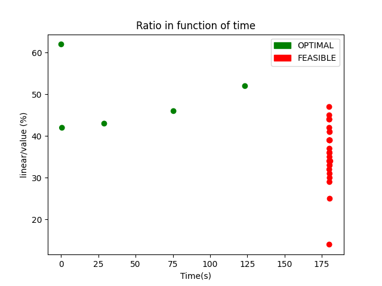

# Comparaison de formulations pour le problème de Lot-Sizing sans capactié avec setups

- [Comparaison de formulations pour le problème de Lot-Sizing sans capactié avec setups](#comparaison-de-formulations-pour-le-problème-de-lot-sizing-sans-capactié-avec-setups)
  - [Introduction](#introduction)
  - [Les modèles](#les-modèles)
    - [Premier modèle](#premier-modèle)
    - [Deuxième modèle](#deuxième-modèle)
  - [Résultats](#résultats)
    - [Premier modèle](#premier-modèle-1)
    - [Deuxième modèle](#deuxième-modèle-1)
  - [Analyse](#analyse)
  - [Conclusion](#conclusion)


## Introduction


## Les modèles
### Premier modèle
  En partant de l'énoncé du problème, et des variables suivantes :
  - $x_{i}$ : quantité produite à la période $i$
  - $y_{i}$ : {0,1} si une production est effectuée à la période $i$ (1 si on produit, 0 sinon)
  - $s_{i}$ : quantité stockée à la fin du mois $i$
  avec $i \in \{0,..., n\}$

  Nous pouvons écrire le modèle PLNE suivant :

  $$
    min \sum_{i=1}^{n} (c_{i}x_{i} + hs_{i} + f_iy_{i}) \\
    s.c. \space\space x_i \leq M y_i, \space\space \forall i \in \{0,...,n\} \\
    s_i + d_i = x_i + s_{i-1}, \space\space \forall i \in \{1,...,n\} \\
    s_0 + d_0 = x_0 \\
  $$

  avec $M$ une constante suffisament grande pour que $x_i \leq M y_i$ soit toujours vérifié. Par exemple ici nous avons pris $M = \sum{d_i}$.

  de plus nous introduisons les variables suivantes :

  - $c_{i}$ : coût de production à la période $i$
  - $h$ : coût de stockage (fixe)
  - $f_{i}$ : coût de mise en marche de la machine à la période $i$


### Deuxième modèle

 En partant de l'énnoncé du problème, et des variables suivantes :
  - Les variables définies précedemment dans le modèle 1 ( $c_{i}$, $h$, $d_{i}$ )
  - $x_{i,j}$ : quantité produite à la période $i$ pour la demande de la période $j$
  - $y_{i}$ : {0,1} si il nous produisons pendant la période $j$
  avec $i \in \{0,..., n\}$
  
  Et en prenant en compte les contraintes suivantes:
  - La demande pour chaque mois j doit être satisfaite
  - On ne peux pas profuire pour une demande future sans produire dans le mois actuel

A partir de cela nous pouvons écrire le modèle PLNE suivant : 
$$
  min \sum_{j=1}^{n}\sum_{i=1}^{j} (x_{i,j}d_jc_i + hx_{i,j}d_i(j-i)) + \sum_{i=1}^{n}(f_iy_i) \\ 
  sc. \space\space \forall{j}\in\{1,\dots,n\}, \sum_{i=1}^{j}x_{i,j} = 1\\
  \forall{i}\in\{1,\dots, n\} ,\sum_{j=i}^{n}x_{i,j} \le My_i\\
$$

  avec $M$ une constante suffisament grande pour que $x_i$ puisse produire jusqu'à toutes les périodes cumulées soit $M = n$.

  de plus nous introduisons les variables suivantes :

  - $c_{i}$ : coût de production à la période $i$
  - $h$ : coût de stockage (fixe)
  - $f_{i}$ : coût de mise en marche de la machine à la période $i$

## Résultats

### Premier modèle

Nous avons appliqué le modèle à plusieurs instances de test, et nous avons obtenu les résultats suivants, les résultats contiennent la valeur de la relaxation linéaire, la valeur et le status de la meilleure solution réalisable calculée, l'écart en % entre la relaxation linéaire et la solution réalisable calculée, et le temps de résolution en secondes, et enfin le nombre de noeuds de l'arbre de branchement.
|Nom de l'instance|Relaxation Linéaire|Status de la solution|Valeur de la solution | Rapport en % | Nombre de noeud | Temps de résolution (s) |
|-----------------|-------------------|---------------------|----------------------|--------------|----------------|------------------------|
|Instance120.1   | 28159.0 | REALISABLE | 77297.0 | 36 | 2147483647 | 180.21 |
|Instance120.10   | 28515.0 | REALISABLE | 86355.0 | 33 | 2147483647 | 180.27 |
|Instance120.2   | 27095.0 | REALISABLE | 68779.0 | 39 | 2147483647 | 180.15 |
|Instance120.3   | 27525.0 | REALISABLE | 91756.0 | 30 | 2147483647 | 180.3 |
|Instance120.4   | 26533.0 | REALISABLE | 86575.0 | 31 | 2147483647 | 180.27 |
|Instance120.5   | 28658.0 | REALISABLE | 97629.0 | 29 | 2147483647 | 180.19 |
|Instance120.6   | 26902.0 | REALISABLE | 65754.0 | 41 | 2147483647 | 180.35 |
|Instance120.7   | 28346.0 | REALISABLE | 83270.0 | 34 | 2147483647 | 180.76 |
|Instance120.8   | 24200.0 | REALISABLE | 178280.0 | 14 | 2147483647 | 180.3 |
|Instance120.9   | 29066.0 | REALISABLE | 89321.0 | 33 | 2147483647 | 180.3 |
|Instance21.1   | 5442.0 | OPTIMALE | 13068.0 | 42 | 2147483647 | 0.6 |
|Instance60.1   | 14093.0 | REALISABLE | 29739.0 | 47 | 2147483647 | 180.02 |
|Instance60.10   | 14003.0 | REALISABLE | 31967.0 | 44 | 2147483647 | 180.3 |
|Instance60.2   | 14297.0 | REALISABLE | 41837.0 | 34 | 2147483647 | 180.3 |
|Instance60.3   | 14223.0 | REALISABLE | 34081.0 | 42 | 2147483647 | 180.05 |
|Instance60.4   | 13505.0 | OPTIMALE | 31131.0 | 43 | 2147483647 | 28.94 |
|Instance60.5   | 14145.0 | REALISABLE | 36112.0 | 39 | 2147483647 | 180.09 |
|Instance60.6   | 12990.0 | OPTIMALE | 25186.0 | 52 | 2147483647 | 123.45 |
|Instance60.7   | 13906.0 | REALISABLE | 30853.0 | 45 | 2147483647 | 180.05 |
|Instance60.8   | 12821.0 | OPTIMALE | 27962.0 | 46 | 2147483647 | 75.46 |
|Instance60.9   | 15532.0 | REALISABLE | 35527.0 | 44 | 2147483647 | 180.05 |
|Instance90.1   | 21004.0 | REALISABLE | 51363.0 | 41 | 2147483647 | 180.28 |
|Instance90.10   | 21126.0 | REALISABLE | 57878.0 | 37 | 2147483647 | 180.16 |
|Instance90.2   | 20672.0 | REALISABLE | 46826.0 | 44 | 2147483647 | 180.05 |
|Instance90.3   | 20573.0 | REALISABLE | 58132.0 | 35 | 2147483647 | 180.21 |
|Instance90.4   | 19671.0 | REALISABLE | 53897.0 | 36 | 2147483647 | 180.18 |
|Instance90.5   | 21131.0 | REALISABLE | 65813.0 | 32 | 2147483647 | 180.05 |
|Instance90.6   | 18659.0 | REALISABLE | 73334.0 | 25 | 2147483647 | 180.05 |
|Instance90.7   | 21314.0 | REALISABLE | 54913.0 | 39 | 2147483647 | 180.37 |
|Instance90.8   | 18996.0 | REALISABLE | 49063.0 | 39 | 2147483647 | 180.05 |
|Instance90.9   | 21773.0 | REALISABLE | 60042.0 | 36 | 2147483647 | 180.26 |
|Toy_Instance   | 1114.0 | OPTIMALE | 1788.0 | 62 | 2147483647 | 0.09 |


Nous avons récolté les résultats pour chacunes des variables, nous pouvons détailler celle de *Toy_Instance* :

```
Période      Demande      Production   Stock        Production ?
-----------------------------------------------------------------
0            30           70.0         40.0         oui
1            25           0.0          15.0         non
2            15           0.0          0.0          non
3            47           106.0        59.0         oui
4            34           0.0          25.0         non
5            10           0.0          15.0         non
6            15           0.0          0.0          non
```
> Résultat détaillé de l'instance : `Toy_Instance.txt`

Rappelons que la solution est **OPTIMALE** et est de **1788.0**, ici le peu de période induit une résolution rapide, en effet le temps de résolution est de **0.09s**. 


Nous pouvons voir sur ce graphique qui représente le rapport entre la relaxation linéaire et le valeur de la solution (qui indique donc de la qualité de la solution trouvée) en fonction du temps de résolution est assez intéréssant. En effet nous pouvons voir que la qualité des solutions optimales (en vert) est globalement supérieur à celles des solutions non optimales. De plus, ce graphique nous confirme que l'algorithme de résolution tourne pour essayer de trouver la solution optimale jusqu'à ce qu'il atteigne le temps limite de résolution (ici 180s).

> Si vous avions étendu notre temps limite de résolution nous aurions pu dresser un graphique du temps de résolution en fonction du nombre de période, ce qui aurait pu nous permettre de voir si le temps de résolution augmente de manière linéaire ou exponentielle ou autre.


### Deuxième modèle

Nous avons enfin appliqué le même procédé au deuxième modèle et nous avons obtenu les résultats suivants :

|Nom de l'instance|Relaxation Linéaire|Status de la solution|Valeur de la solution | Rapport en % | Nombre de noeud | Temps de résolution (s) |
|-----------------|-------------------|---------------------|----------------------|--------------|----------------|------------------------|
|Instance120.1.txt   | 28159.0 | OPTIMAL | 75417.0 | 37 | 2147483647 | 2.91 |
|Instance120.10.txt   | 28515.0 | OPTIMAL | 85103.0 | 34 | 2147483647 | 3.0 |
|Instance120.2.txt   | 27095.0 | OPTIMAL | 67630.0 | 40 | 2147483647 | 2.69 |
|Instance120.3.txt   | 27525.0 | OPTIMAL | 86778.0 | 32 | 2147483647 | 2.87 |
|Instance120.4.txt   | 26533.0 | OPTIMAL | 82367.0 | 32 | 2147483647 | 2.73 |
|Instance120.5.txt   | 28658.0 | OPTIMAL | 96316.0 | 30 | 2147483647 | 2.96 |
|Instance120.6.txt   | 26902.0 | OPTIMAL | 65704.0 | 41 | 2147483647 | 2.15 |
|Instance120.7.txt   | 28346.0 | OPTIMAL | 81866.0 | 35 | 2147483647 | 3.25 |
|Instance120.8.txt   | 24200.0 | OPTIMAL | 70734.0 | 34 | 2147483647 | 4.78 |
|Instance120.9.txt   | 29066.0 | OPTIMAL | 87909.0 | 33 | 2147483647 | 3.54 |
|Instance21.1.txt   | 5441.999999999999 | OPTIMAL | 13068.0 | 42 | 2147483647 | 0.19 |
|Instance60.1.txt   | 14093.0 | OPTIMAL | 29739.0 | 47 | 2147483647 | 1.08 |
|Instance60.10.txt   | 14003.0 | OPTIMAL | 31809.0 | 44 | 2147483647 | 0.88 |
|Instance60.2.txt   | 14297.0 | OPTIMAL | 27572.0 | 52 | 2147483647 | 0.58 |
|Instance60.3.txt   | 14223.0 | OPTIMAL | 34081.0 | 42 | 2147483647 | 0.86 |
|Instance60.4.txt   | 13505.0 | OPTIMAL | 31131.0 | 43 | 2147483647 | 0.7 |
|Instance60.5.txt   | 14145.0 | OPTIMAL | 35693.0 | 40 | 2147483647 | 0.91 |
|Instance60.6.txt   | 12990.0 | OPTIMAL | 25186.0 | 52 | 2147483647 | 0.82 |
|Instance60.7.txt   | 13906.0 | OPTIMAL | 30853.0 | 45 | 2147483647 | 0.71 |
|Instance60.8.txt   | 12821.0 | OPTIMAL | 27962.0 | 46 | 2147483647 | 0.61 |
|Instance60.9.txt   | 15532.0 | OPTIMAL | 35492.0 | 44 | 2147483647 | 0.76 |
|Instance90.1.txt   | 21004.0 | OPTIMAL | 50943.0 | 41 | 2147483647 | 1.96 |
|Instance90.10.txt   | 21126.0 | OPTIMAL | 56514.0 | 37 | 2147483647 | 2.94 |
|Instance90.2.txt   | 20672.0 | OPTIMAL | 46518.0 | 44 | 2147483647 | 2.02 |
|Instance90.3.txt   | 20573.0 | OPTIMAL | 57613.0 | 36 | 2147483647 | 2.13 |
|Instance90.4.txt   | 19671.0 | OPTIMAL | 53897.0 | 36 | 2147483647 | 2.16 |
|Instance90.5.txt   | 21131.0 | OPTIMAL | 64123.0 | 33 | 2147483647 | 1.62 |
|Instance90.6.txt   | 18659.0 | OPTIMAL | 41811.0 | 45 | 2147483647 | 1.41 |
|Instance90.7.txt   | 21314.0 | OPTIMAL | 54913.0 | 39 | 2147483647 | 1.48 |
|Instance90.8.txt   | 18996.0 | OPTIMAL | 49010.0 | 39 | 2147483647 | 1.56 |
|Instance90.9.txt   | 21773.0 | OPTIMAL | 59424.0 | 37 | 2147483647 | 1.58 |
|Toy_Instance.txt   | 1114.0 | OPTIMAL | 1788.0 | 62 | 2147483647 | 0.05 |


## Analyse
Analysons les résultats obtenus de l'application des deux modèles.

Premièrement, en regardant les valeurs obtenues, on observe que le deuxième modèle donne des résultats optimaux pour toutes les instances, tandis que le premier modèle donne des résultats réalisables ou optimaux, mais pas toujours. Cela indique que le deuxième modèle a une performance de résolution supérieure par rapport au premier. En d'autres termes, le deuxième modèle a une meilleure capacité à trouver la solution optimale.

Deuxièmement, en termes de temps de résolution, le deuxième modèle est également supérieur au premier. En effet, pour de nombreuses instances, le premier modèle atteint un temps de résolution de 180 secondes, ce qui est significativement plus élevé que les temps de résolution du deuxième modèle. Par exemple, pour l'instance "Instance120.1", le premier modèle prend 180.21 secondes pour trouver la solution, tandis que le deuxième modèle ne prend que 2.91 secondes. 

En ce qui concerne le nombre de nœuds dans l'arbre de branchement, les deux modèles atteignent le maximum possible (2147483647) pour toutes les instances. Cependant, ce chiffre peut être trompeur. En effet, il est possible que ce nombre maximum soit atteint simplement parce que la limite de temps de résolution est atteinte. C'est probablement ce qui se passe pour le premier modèle, compte tenu de ses temps de résolution élevés. 

Enfin, en ce qui concerne l'écart en pourcentage entre la relaxation linéaire et la solution réalisable, les deux modèles semblent similaires. Cependant, il est important de noter que dans le cas du deuxième modèle, cet écart est calculé par rapport à une solution optimale, et non pas seulement réalisable.

## Conclusion
En conclusion, le deuxième modèle semble être supérieur au premier en termes de performance de résolution et de temps de résolution. Il serait donc recommandé d'utiliser le deuxième modèle pour résoudre ce type de problème. Cependant, il serait également intéressant d'explorer d'autres modèles ou d'améliorer ces modèles existants pour tenter de réduire davantage le temps de résolution et d'améliorer la performance de résolution.
